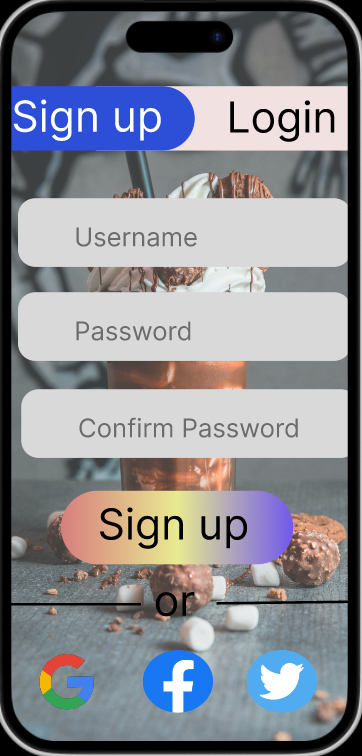
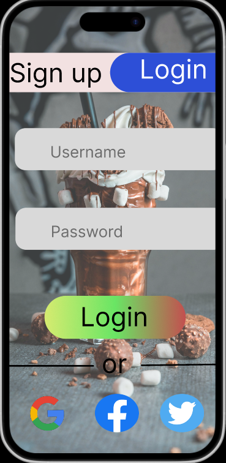
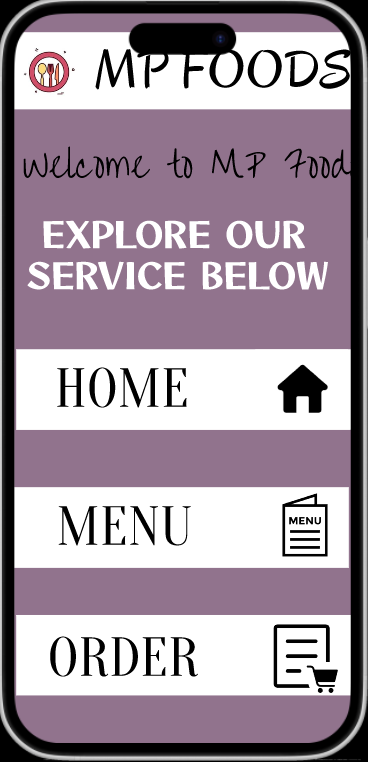
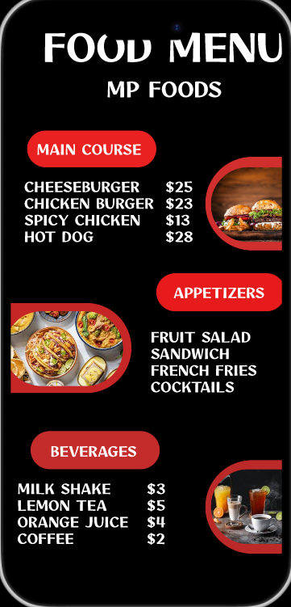
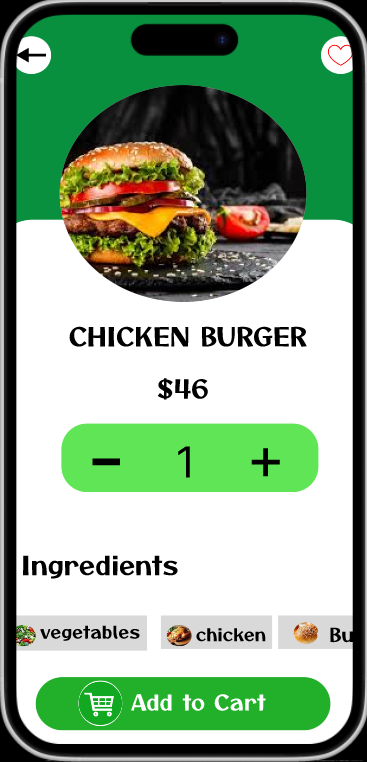
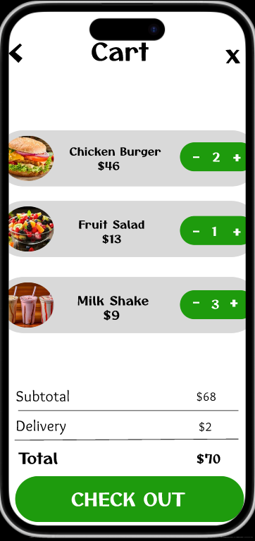
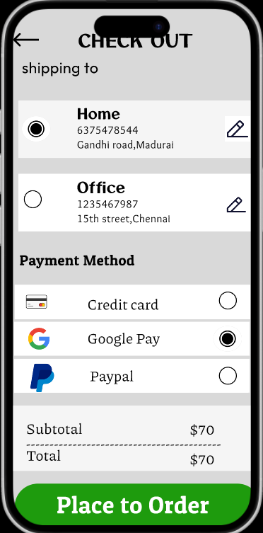
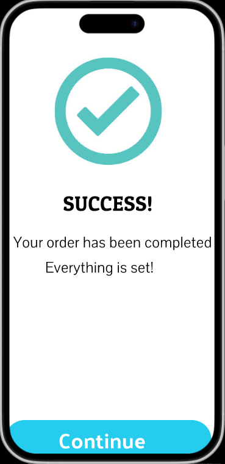

# food_ordering

Signup Page:
      The Signup Page allows new users to create an account by entering their username, password, and confirm password. It also offers quick signup using Google, Twitter, and Facebook 🔐. The form includes validation to ensure the passwords match and meet security standards. After successful signup, users are redirected to the login or home page.

  

Login Page:
     The Login Page lets registered users sign in using their username and password. For convenience, it supports social logins through Google, Twitter, and Facebook 💻. The page ensures secure login by validating user credentials. After a successful login, users are taken to the home or dashboard page.

  

Home Page:
    The Home Page welcomes users to MP FOODS with a friendly greeting and clear layout. It highlights the main services like Home, Menu, and Order 🍽️. Each option is supported by icons for easy navigation. This page acts as the central hub for exploring the app.

  

Menu Page:
     The Menu Page showcases the full food menu divided into Main Course, Appetizers, and Beverages 🍔🥤. Each item is listed with its name and price, and visually supported with appealing food images. This organized layout helps users easily browse and choose what to order.

  

Add to Cart page:
       The Add to Cart Page displays detailed information about the selected food item, including its name, price, and ingredients. Users can adjust the quantity using +/- buttons and view tags like vegetables, chicken, etc. A bold “Add to Cart” button lets users quickly add the item to their cart.

  

Food_Ordering page:
      The Cart Page shows all selected items with their quantities, prices, and images. Users can update quantities directly using +/- buttons. It calculates the subtotal, includes the delivery fee, and displays the total amount 💰. A clear "CHECK OUT" button leads users to finalize the order.

   

Payment Page:
       The Checkout Page lets users select or edit a delivery address (e.g., Home or Office) and choose their payment method. Options include Credit Card, Google Pay, and PayPal 🏦. It shows the subtotal and final total, and a bold “Place to Order” button completes the transaction.

    

Review page:
       The Review Page allows users to explore detailed product descriptions along with customer ratings and feedback. Each food item is presented with its image, name, price, and a short description 🍔. Below, real users like Ram A, Vijay V, and Ajith A have shared their reviews, giving future buyers helpful insights. A friendly “Give Your Review” 💬 button lets new users add their own opinions to improve community trust.

   ![Review]{Screenshot/Review.png)
  
Success Page:
       The Success Page 🎉 confirms that your order has been completed ✅ without any issues. It proudly displays a bold “SUCCESS!” message along with a large checkmark icon to reassure the user. The message “Everything is set!” 🛒 gives a sense of completion and satisfaction. A bright “Continue” 🔄 button encourages users to move forward or return to the home screen.

 
